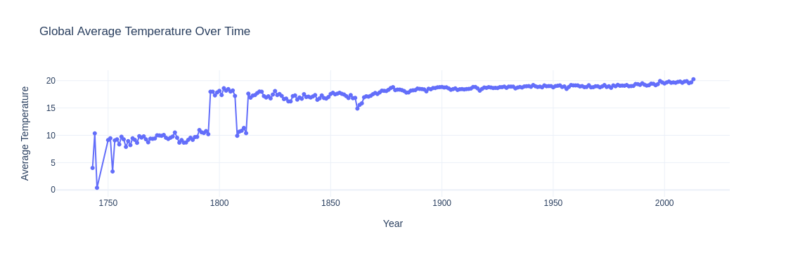
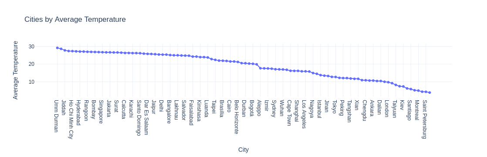
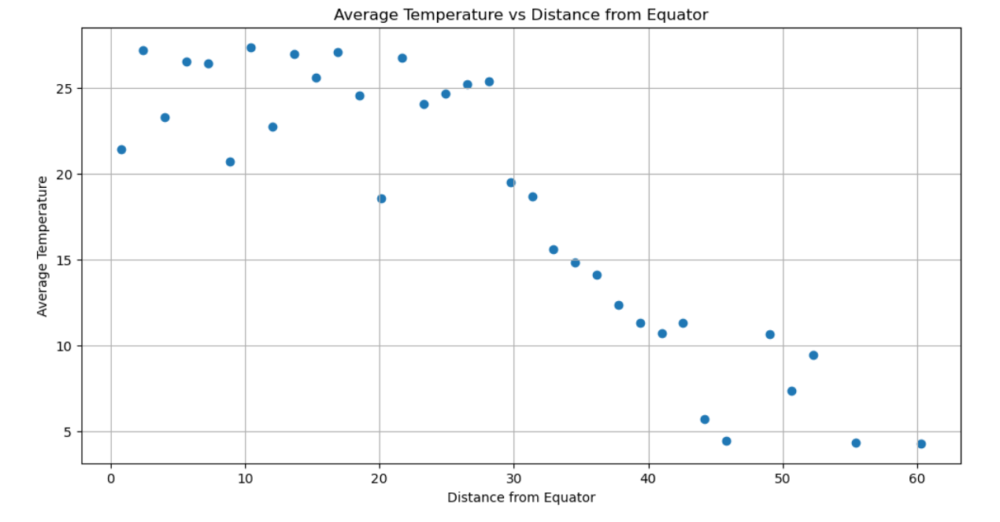

# 🌍 Global Climate Trends and Geographic Drivers of Temperature Variation 1891-2012.

## Overview

This project investigates historical climate records from major cities worldwide to understand how temperatures have evolved over time and what geographic factors influence regional climate differences. The analysis combines data quality assessment, exploratory data analysis, uncertainty evaluation, and geographic modeling to uncover long-term temperature patterns and assess the reliability of climate observations.

---

## Business Question

How have global temperatures evolved over time, and what geographic factors drive regional climate differences?

Understanding long-term climate patterns is essential for organizations involved in:
- Agriculture
- Infrastructure planning
- Energy management
- Environmental policy
- Climate risk assessment

---

## 📊 Dataset
- Source: Kaggle (GlobalLandTemperatures_GlobalLandTemperaturesByMajorCity)  
  [Dataset](GlobalLandTemperatures_GlobalLandTemperaturesByMajorCity.csv)
- Records: 293,178
- Time Period: 1743–2013
- Analysis Period: 1891–2012
 
--- 

## Tools Used
- Python
- Pandas
- NumPy
- Matplotlib
- Plotly

---

## Key Findings
- Global temperatures exhibit a long-term warming trend.
- Temperature records before 1891 are sparse and less reliable.
- Measurement uncertainty decreases significantly over time.
- Sudan is the warmest country on average, while Russia is the coldest.
- Distance from the equator is strongly associated with temperature (r = -0.884).
- Extreme temperatures appear to be genuine climatic observations rather than measurement anomalies.

---

## Sample Visualizations

### Global Average Temperature Over Time

### Cities by Average Temperature

### Average Temperature vs Distance from Equator

---

## Conclusion

The analysis demonstrates both a long-term warming trend and the significant influence of geographic location on climate patterns. Geographic factors, particularly distance from the equator, explain a substantial portion of regional temperature variation.
